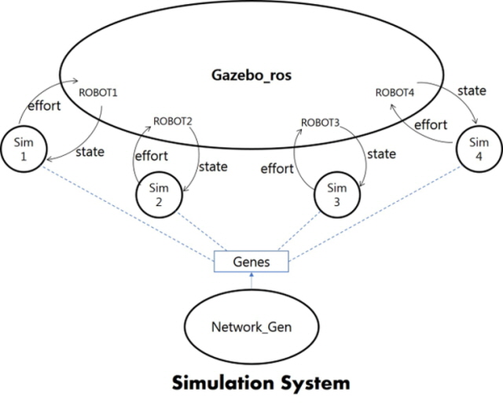

# WalkYTo
### :Walk Yourself, Toddler!

Hanyang University, Robotics, CPS & AI LAB

Undergraduate Researcher Program
>Junyeob Beak(wnsdlqjtm@naver.com), Hyeonwoo Park(ppaa1135@naver.com), Seunghwan Yu(sinanju06@naver.com)

#### Nessesary for user to launch this project.
- "gazebo_ros_pkgs" for graphic simulation -- ros package
- "neat-python" for genetic network model -- python module
- "tensorflow" for DQN implementation -- python module

### gazebo simulation system
with bell_and_faraday launch file

